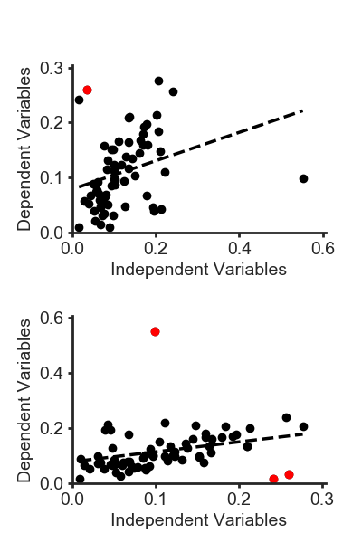
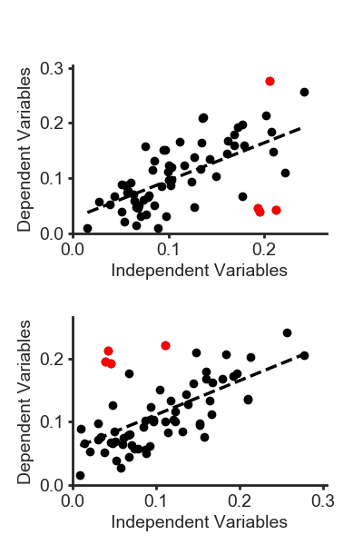
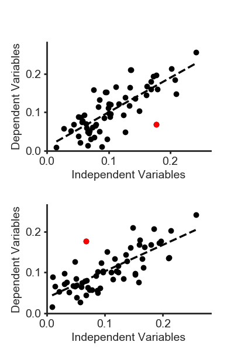
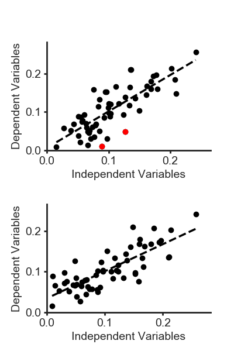
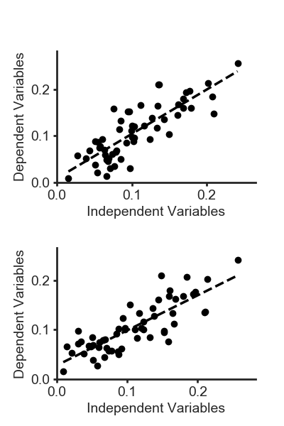

# Iterative IQR

by MAS
03/2012

## Introduction

This script identifies outliers from a linear regression model using the interquartile range method (IQR)

Users have the option to:

* Perform conventional IQR analysis

* Perform conventional IQR analysis with swapped axes

* Perform IQR iteratively until no more outliers are identified

* Perform IQR iteratively with swapped axes

To swap axes, set ```SWAP_FLAG``` = 'y', otherwise ```SWAP_FLAG``` = 'n'

To iterate, set ```IT_FLAG``` = 'y', otherwise ```IT_FLAG``` = 'n'

I wrote this script to automate analysis that was previously done using an Excel spreadsheet compiled by Dr. Yinan Fu

Versions of this script have been used in the following publications:

* Fu Y et al JACS 2012 132(20) 8543-50
* Stetz M et al JBNMR 2016 65(3-4) 157-70

## Conventional IQR Analysis

The data are first modeled using linear regression. Differences between the observed and modeled data are calculated and ranked by percentile.

The IQR is defined as the difference between upper and lower quartiles (75th and 25th percentile, respectively)

Outliers are defined as the following:

* Difference between observed and modeled is below the 25th percentile - 1.5IQR
* Difference between observed and modeled is above the 75th percentile + 1.5IQR

## Swap Axes

The analysis is performed as described above, then the analysis is performed again but the dependent and independent variables are swapped.

## Iterative IQR Analysis

If the script is run in iterative mode (IT_FLAG = 'y'), the IQR analysis is performed as follows:

* Conventional IQR analysis to identify outliers
* Remove outliers 
* Determine new linear regression model for remaining data
* Conventional IQR analysis to identify outliers
* Iterate until no more outliers are identified

## Input Data Format

Data should be in a tab delimited text file with three columns:
* Column 1: Data Identifier/Name
* Column 2: X Values
* Column 3: Y Values

## Example Output

Test data is provided as ```test.txt```

A text file called ```summary.txt``` is generated which lists the quartile values and the outliers removed.

Plots are also generated as ```.png``` files with outliers shown in red.

Some example plots generated after running the script on ```test.txt``` are shown in the "example_output" directory

* Below is an example plot of traditional IQR outlier identification with ```SWP_FLAG = 'y'```



* Below is an example plot of IQR analysis performd with ```SWAP_FLAG = 'y'``` and ```IT_FLAG = 'y'```

Round 1:   


Round 2:  



Round 3:  



Round 4:  



Round 5:  

